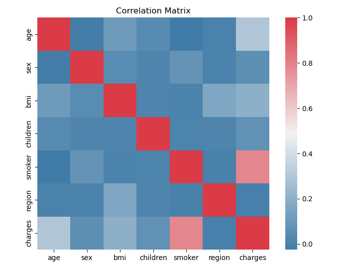
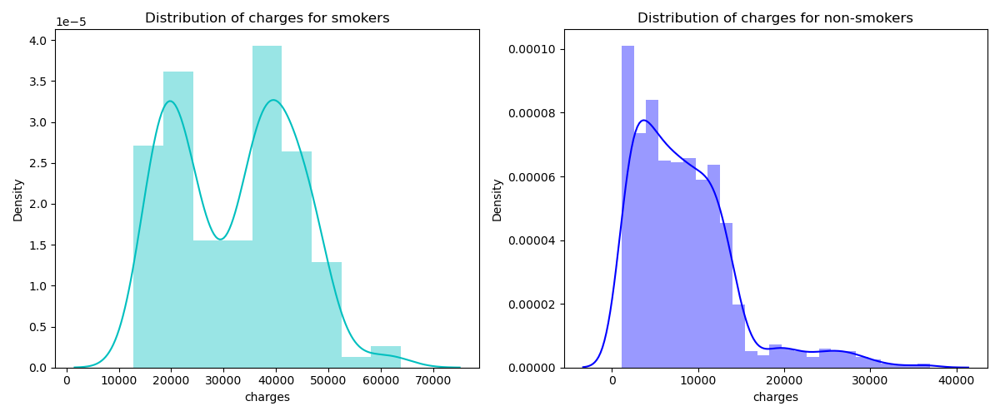
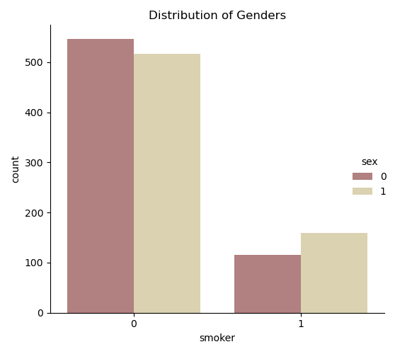

# Medical Cost Data Analysis-EDA
Today we will explore a data set dedicated to the cost of treatment of different patients. The cost of treatment depends on many factors: diagnosis, type of clinic, city of residence, age and so on. We have no data on the diagnosis of patients. But we have other information that can help us to make a conclusion about the health of patients and practice regression analysis. In any case, I wish you to be healthy! Let's look at our data.

# Steps
* Encode categorical features like gender, smoker, etc.
* Correlation between features on costs
```
region     -0.006208
sex         0.057292
children    0.067998
bmi         0.198341
age         0.299008
smoker      0.787251
charges     1.000000
```

* Distribution of charges for smokers and non-smokers
* Distribution of genders
* 

## Visualizition Analysis



*A strong correlation is observed only with the fact of smoking the patient. To be honest, I expected a higher correlation with bmi. Well. We investigate smoking in more detail.*


*Smoking patients spend more on treatment. But there is a feeling that the number of non-smoking patients is greater.*



*Note that women are coded with the symbol " 1 "and men - "0".*

Also we can notice that more male smokers than women smokers. It can be assumed that the total cost of treatment in men will be more than in women, given the impact of smoking.


